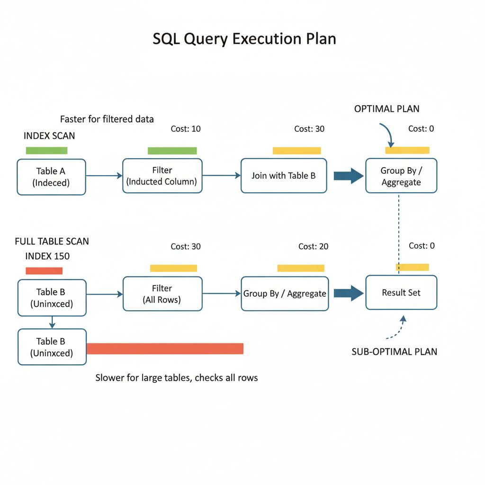
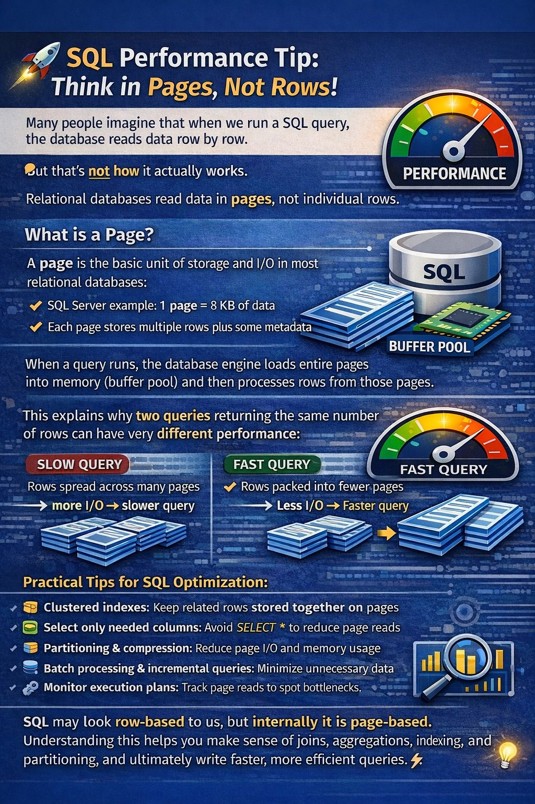
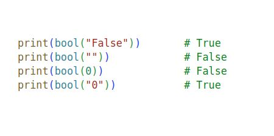

Query Execution Plans — Understanding How Databases Think

Your SQL query may look simple…
but the database has its own strategy.

🧠 What Is a Query Execution Plan?

It’s the database’s internal roadmap showing how a query will be executed.

It reveals whether the DB will:

• Use an index

• Scan the whole table

• Join tables efficiently

• Sort in memory or disk

🔹 Why It Matters

⚙️ Detect slow queries
⚙️ Verify index usage
⚙️ Optimize joins
⚙️ Improve overall performance

🔹 What to Watch For

🚩 Full table scans on large tables
🚩 Missing index usage
🚩 Expensive nested loops
🚩 Large sort operations

📌 Pro Tip:
Never guess performance — always check the execution plan.

Databases don’t execute your SQL — they execute the plan.

#############################################

🚀 SQL Performance Tip: Think in Pages, Not Rows!
🤔 Many people imagine that when we run a SQL query, the database reads data row by row.
❌ But that’s not how it actually works.
🗄️ Relational databases read data in pages, not individual rows.

📄 What is a Page?
A page is the basic unit of storage and I/O in most relational databases:
🛢️ SQL Server example: 1 page = 8 KB of data
📊 Each page stores multiple rows plus some metadata

⚡ When a query runs, the database engine loads entire pages into memory (buffer pool) and then processes rows from those pages.

This explains why two queries returning the same number of rows can have very different performance:
🐢 Slow Query: Rows spread across many pages → more I/O → slower query
⚡ Fast Query: Rows packed into fewer pages → less I/O → faster query

💡 Why This Matters for Performance
Understanding pages helps explain:
🔹 Why SELECT * can be expensive
🔹 Why indexes improve query performance
🔹 Why table scans vs index seeks matter
🔹 Why I/O is often the main bottleneck
🔹 Why query optimization often focuses on reducing page reads

🛠️ Practical Tips for SQL Optimization
📌 Clustered indexes: Keep related rows stored together on pages
📌 Select only needed columns: Avoid SELECT * to reduce page reads
📌 Partitioning & compression: Reduce page I/O and memory usage
📌 Batch processing & incremental queries: Minimize unnecessary data movement
📌 Monitor execution plans: Track page reads to spot bottlenecks

🧠 SQL may look row-based to us, but internally it is page-based.
✅ Understanding this helps you make sense of joins, aggregations, indexing, and partitioning, and ultimately write faster, more efficient queries. 💡

Python Surprise: Why is bool("False") → True?

Check this:
 - bool("False") → True.
 - bool("") → False.
 - bool(0) → False.
 - bool("0") → True.

Confusing?
Here’s the simple rule:
 - Python does NOT check the meaning of a string.
 - It only checks whether it is empty or not.
 
 • Empty string → False.
 • Any non-empty string → True.

So even "False" and "0" are True,
because they contain characters.

Why this matters:
- If you write:
 if user_input:
And the user types "False",
the condition will still execute.

This can silently break logic in forms, APIs, or backend validations.
Rule to remember:
 - Empty → False
 - Non-empty → True

🔹 First: What is an Iterator?

An iterator is an object that:

Implements __iter__()

Implements __next__()

It returns one value at a time and remembers its state.

class MyIterator:
    def __init__(self, max):
        self.max = max
        self.current = 0

    def __iter__(self):
        return self

    def __next__(self):
        if self.current < self.max:
            self.current += 1
            return self.current
        else:
            raise StopIteration
🔹 What is a Generator?

A generator is a simpler way to create an iterator using yield.

def my_generator(max):
    current = 0
    while current < max:
        current += 1
        yield current

A generator automatically creates an iterator for you.

🔥 Key Differences
Feature	Iterator	Generator
How created	Class with __iter__() and __next__()	Function with yield
Code size	More code	Very short
State handling	Manual	Automatic
Complexity	More control	Simpler
Memory efficient	Yes	Yes
🤔 If Generators Exist, Why Do We Need Iterators?

Excellent question 👇

Generators are actually a type of iterator.

But iterators are still required because:

1️⃣ Full Control Over Behavior

With iterators, you can customize behavior deeply.

Example:

Reset logic

Multiple iteration strategies

Complex state tracking

Interaction with other class methods

Generators are limited to function-based flow.

2️⃣ Object-Oriented Design

If you're building a class (like a custom data structure), you must implement an iterator to make it iterable.

Example:

class MyNumbers:
    def __init__(self, numbers):
        self.numbers = numbers

    def __iter__(self):
        return iter(self.numbers)

Here we use iterator protocol inside a class.

Generators alone can't replace this design need.

3️⃣ Multiple Independent Iterators

With iterator classes, you can create multiple independent iterator objects from the same class.

Generators are single-use once exhausted.

gen = my_generator(3)

for i in gen:
    print(i)

for i in gen:
    print(i)  # Nothing prints (already exhausted)
4️⃣ Some Libraries Expect Iterator Objects

Certain low-level implementations require explicit iterator protocol.

🧠 Important Concept
All generators are iterators.
But not all iterators are generators.

Generators are a convenient shortcut for creating iterators.

🎯 Simple Analogy

Iterator = Manual car (more control)

Generator = Automatic car (easy to use)

Both drive. One gives more control.

🚀 When To Use What?
Use Case	Recommended
Simple sequence generation	Generator
Complex iteration logic	Iterator class
Custom data structure	Iterator
Quick lazy computation	Generator

#when we are not using Generators?

🎯 Real-World Interview Explanation (Best Answer)

If interviewer asks:

“When would you NOT use a generator?”

You can say:

"I would avoid using a generator when I need random access, multiple iterations over the same dataset, or when the dataset is small and memory efficiency is not a concern. Since generators are single-use and do not support indexing or length operations, a list is more appropriate in those cases. I choose generators mainly for large datasets, streaming data, or memory-sensitive applications."

That’s a strong senior-level answer 💪

🚀 Even Better Interview Answer (With Example)

You can add:

"For example, if I’m processing millions of database records, I’d use a generator to stream results and save memory. But if I need to sort, index, or repeatedly access the data, I’d convert it to a list."

🔥 One-Line Smart Answer

“Generators are great for memory efficiency and lazy evaluation, but not suitable when data needs to be reused, indexed, or fully materialized.”

####################################################
both generators and iterators are executing one element at time then why we need iterator still

Very sharp question 👏
Yes — both iterators and generators produce one element at a time.

So why do we still need iterators?

Let’s clarify this properly.

🔥 First Important Truth

✅ A generator is just a shortcut way to create an iterator.
❗ Iterators are the fundamental concept.
🔹 Generators are built on top of iterators.

Python’s iteration system is based on the iterator protocol, not generators.

🧠 Why Iterator Is Still Needed?

Even though generators exist, iterators are needed for these reasons:

1️⃣ Iterator Is the Core Protocol (Foundation of Python)

A for loop works because of this:

obj.__iter__()
obj.__next__()

This is the iterator protocol.

Generators internally implement this protocol automatically.

So:

Iterators = base concept

Generators = convenience tool

Without iterator protocol → generators wouldn’t exist.

2️⃣ When You Need Full Control Over Iteration

Generators:

Pause at yield

Resume automatically

But sometimes you need:

Reset behavior

Complex state management

Multiple iteration strategies

Custom stopping conditions

Interaction with other class methods

Example (manual control):

class Counter:
    def __init__(self, max):
        self.max = max
        self.current = 0

    def __iter__(self):
        return self

    def __next__(self):
        if self.current < self.max:
            self.current += 1
            return self.current
        raise StopIteration

This gives full control over iteration logic.

3️⃣ Multiple Independent Iterators from Same Object

Generators are usually single-use.

Iterator classes allow you to create multiple independent iterator objects.

Example concept:

iter1 = iter(obj)
iter2 = iter(obj)

Each can maintain separate state.

Generators don't naturally provide this flexibility unless carefully designed.

4️⃣ Custom Data Structures

If you build:

Tree

Graph

Linked List

Custom container

You must implement __iter__().

Inside that, you may use a generator — but the iterator protocol is required.

Example:

class MyContainer:
    def __init__(self, data):
        self.data = data

    def __iter__(self):
        return iter(self.data)

Here, iterator protocol makes object iterable.

5️⃣ Generators Cannot Replace All Iterator Use Cases

Generators:

Cannot easily rewind

Cannot easily support bidirectional traversal

Not ideal for very complex iteration engines

Manual iterators can.

🧩 Big Picture

Think like this:

Iterator Protocol  →  Generator (shortcut implementation)

Generators depend on iterators.

Iterators do NOT depend on generators.

🎯 Interview-Level Answer

If interviewer asks:

"If both produce one element at a time, why do we still need iterators?"

Strong answer:

"Generators are a convenient way to create iterators, but the iterator protocol is the core mechanism that powers Python’s iteration system. Iterators give full control over state and behavior, while generators simplify common iteration patterns. For complex custom data structures or advanced iteration logic, explicit iterator implementations are still necessary."

That’s a solid senior-level response.

🚀 Simple Analogy

Iterator → Engine
Generator → Automatic engine builder

You still need the engine concept.

🔥 Final Takeaway

We don’t choose between them like competitors.

Iterator = concept + protocol (foundation)

Generator = easy way to implement iterator

Both are needed. Generators don’t replace iterators — they use them.

#################################################################
🚀 When to Use __slots__??
✅ Use it when:

You create millions of objects

Objects have fixed attributes

Memory usage matters (e.g., caches, graph nodes, trees)

Example:

LRU/LFU cache nodes

AST nodes

Game entities

Large data structures

❌ Don’t use it when:??

You need dynamic attributes

You rely on __dict__

You use multiple inheritance (can complicate things)

Let’s break down __slots__ in Python carefully — it’s a subtle but powerful tool for memory and performance optimization.

🟢 What is __slots__?

Normally, every Python object stores its attributes in a per-object dictionary (__dict__).

class Point:
    def __init__(self, x, y):
        self.x = x
        self.y = y

p = Point(1, 2)
print(p.__dict__)  # {'x': 1, 'y': 2}

This allows dynamic attribute assignment: you can add new attributes at runtime.

But it comes with memory overhead (every object has a dict) and slightly slower attribute access.

__slots__ replaces __dict__ with a fixed, static structure.

class Point:
    __slots__ = ('x', 'y')  # fixed attribute list

    def __init__(self, x, y):
        self.x = x
        self.y = y

p = Point(1, 2)
# p.__dict__  # ❌ AttributeError

Only attributes listed in __slots__ can exist.

Python allocates memory statically for these attributes → less memory per object.

Attribute access is slightly faster.

🟣 Benefits of __slots__

Memory savings

Each object doesn’t need a __dict__.

Example: millions of small objects (like cache nodes or tree nodes) use significantly less memory.

Faster attribute access

Fixed slots allow direct access without dictionary lookup.

Prevents dynamic attributes

Trying to assign an attribute not in __slots__ raises AttributeError.

🔹 Example
class Node:
    __slots__ = ('key', 'value', 'next')

    def __init__(self, key, value):
        self.key = key
        self.value = value
        self.next = None

node = Node(1, 'A')
node.key = 2      # ✅ works
node.prev = None  # ❌ AttributeError: 'Node' object has no attribute 'prev'
⚠️ Things to Watch Out For

No __dict__

If you need dynamic attributes, __slots__ will block them.

No multiple inheritance complications

If a parent class uses __slots__, child classes must also define __slots__.

Weak references

If you need weak references (weakref), include __weakref__ in slots.

🔹 When to Use __slots__

✅ Use it when:

You have a class with fixed attributes.

You create many instances → memory critical.

You want faster attribute access.

Example: Nodes in LFU/LRU cache, tree nodes, or game entities.

❌ Don’t use it when:

You need dynamic attributes.

You heavily use multiple inheritance without care.

⚡ Senior-Level Tip

For an LFU cache node, adding __slots__ is a neat optimization:

class Node:
    __slots__ = ('key', 'value', 'freq', 'prev', 'next')

    def __init__(self, key, value):
        self.key = key
        self.value = value
        self.freq = 1
        self.prev = None
        self.next = None

Saves memory for potentially thousands of nodes.

Speeds up frequent attribute access (node.freq, node.next).

##############################################################

Absolutely! Let’s go deep into closures and functions in Python with clear explanations and coding examples. This is a common topic in interviews and Python mastery.

🟢 What is a Closure?

A closure is a function that:

Is defined inside another function (nested function)

Remembers the variables from its enclosing scope even after that scope has finished execution

In short:

A closure “remembers” the environment in which it was created.

🔹 Basic Example
def outer(x):
    def inner(y):
        return x + y  # inner remembers x
    return inner

f = outer(10)
print(f(5))  # 15
print(f(20)) # 30

✅ Explanation:

outer(10) returns inner function

inner remembers x = 10 even though outer has finished execution

f is now a closure over x

🔹 Why Use Closures?

Data encapsulation: Hide variables without using classes

Factory functions: Create customized functions dynamically

Maintain state: Like objects, but functional

🔹 Example 1: Function Factory
def power_factory(exp):
    def power(x):
        return x ** exp
    return power

square = power_factory(2)
cube = power_factory(3)

print(square(5))  # 25
print(cube(2))    # 8

square remembers exp = 2

cube remembers exp = 3

No classes needed

🔹 Example 2: Maintaining State
def counter():
    count = 0
    def increment():
        nonlocal count  # required to modify count in enclosing scope
        count += 1
        return count
    return increment

c = counter()
print(c())  # 1
print(c())  # 2
print(c())  # 3

count is persistent across calls to increment

nonlocal allows modifying the outer variable

This mimics object-like behavior without a class

🔹 Example 3: LRU-like Memoization Using Closure
def memoize(func):
    cache = {}
    def wrapper(n):
        if n in cache:
            print(f"Cache hit for {n}")
            return cache[n]
        result = func(n)
        cache[n] = result
        return result
    return wrapper

@memoize
def factorial(n):
    if n == 0: return 1
    return n * factorial(n-1)

print(factorial(5))  # calculates and caches
print(factorial(5))  # cache hit

✅ Explanation:

cache persists in the closure

wrapper remembers it every call

This is exactly how decorators like functools.lru_cache work internally

🔹 Key Rules for Closures

Must have a nested function

Nested function must refer to a variable from outer scope

Outer function must return the inner function

🔹 Difference Between Closures and Regular Nested Functions

Nested function: defined inside another, but does not need to capture outer variables

Closure: remembers outer variables

def outer(x):
    def inner(y):
        return y * 2  # does NOT use x → not a closure
    return inner
🟣 Summary
Concept	Python Example	Use Case
Nested Function	def outer(): def inner(): ...	Scope encapsulation
Closure	inner refers to x from outer	Maintain state, factory functions
Nonlocal keyword	nonlocal var	Modify outer variable in closure
Memoization	cache inside closure	Performance optimization

Closures are super useful in:

Decorators

Caching / LRU

Factory functions

Callbacks with state